# Домашнее задание к занятию «Запуск приложений в K8S» Тукаев Айрат

### Цель задания

В тестовой среде для работы с Kubernetes, установленной в предыдущем ДЗ, необходимо развернуть Deployment с приложением, состоящим из нескольких контейнеров, и масштабировать его.

------

### Чеклист готовности к домашнему заданию

1. Установленное k8s-решение (например, MicroK8S).
2. Установленный локальный kubectl.
3. Редактор YAML-файлов с подключённым git-репозиторием.

------

### Инструменты и дополнительные материалы, которые пригодятся для выполнения задания

1. [Описание](https://kubernetes.io/docs/concepts/workloads/controllers/deployment/) Deployment и примеры манифестов.
2. [Описание](https://kubernetes.io/docs/concepts/workloads/pods/init-containers/) Init-контейнеров.
3. [Описание](https://github.com/wbitt/Network-MultiTool) Multitool.

------

### Задание 1. Создать Deployment и обеспечить доступ к репликам приложения из другого Pod

1. Создать Deployment приложения, состоящего из двух контейнеров — nginx и multitool. Решить возникшую ошибку.
2. После запуска увеличить количество реплик работающего приложения до 2.
3. Продемонстрировать количество подов до и после масштабирования.
4. Создать Service, который обеспечит доступ до реплик приложений из п.1.
5. Создать отдельный Pod с приложением multitool и убедиться с помощью `curl`, что из пода есть доступ до приложений из п.1.


**Выполнение:**  
Создал отдельный namespace "netology".  

    

  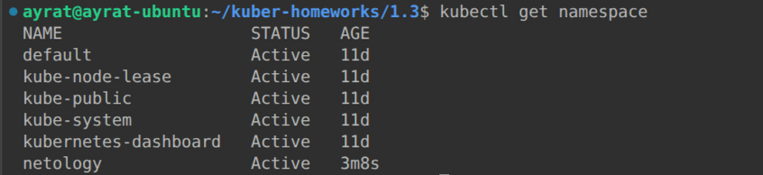  

Написал манифест Deployment приложения, состоящего из двух контейнеров — nginx и multitool.  
[Ссылка на манифест Deployment](https://github.com/AyratTukay/kuber-homeworks/blob/main/1.3/deployment.yaml)  
Запустил Deployment:  

  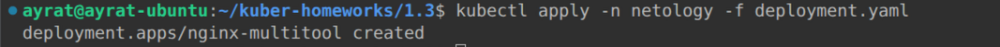  

  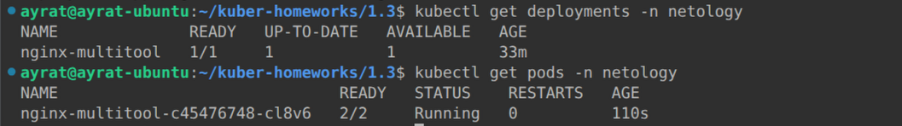  

Увеличил количество реплик работающего приложения до 2:  

  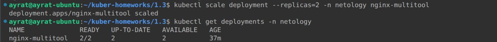  

После масштабирования стало 2 пода:  

  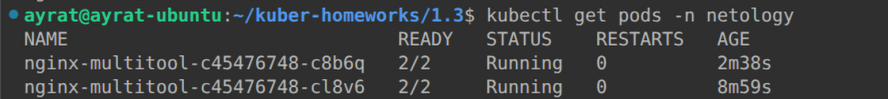  

Создал Service, который обеспечит доступ до реплик приложений.  
[Ссылка на манифест Service](https://github.com/AyratTukay/kuber-homeworks/blob/main/1.3/nginx-multitool-svc.yaml)  
Применил манифест:  

  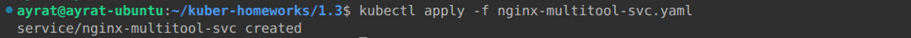  

Проверил сервисы:  

  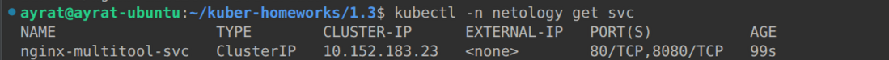  

Создал отдельный Pod с приложением multitool.  
[Ссылка на манифест multitool](https://github.com/AyratTukay/kuber-homeworks/blob/main/1.3/multitool.yaml)  
Применил манифест:  

    

Проверил поды в namespace netology:  

  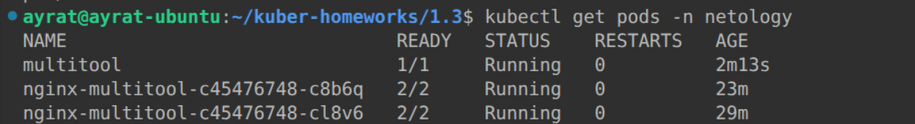  

Убедился с помощью `curl`, что из пода есть доступ до приложений.  

  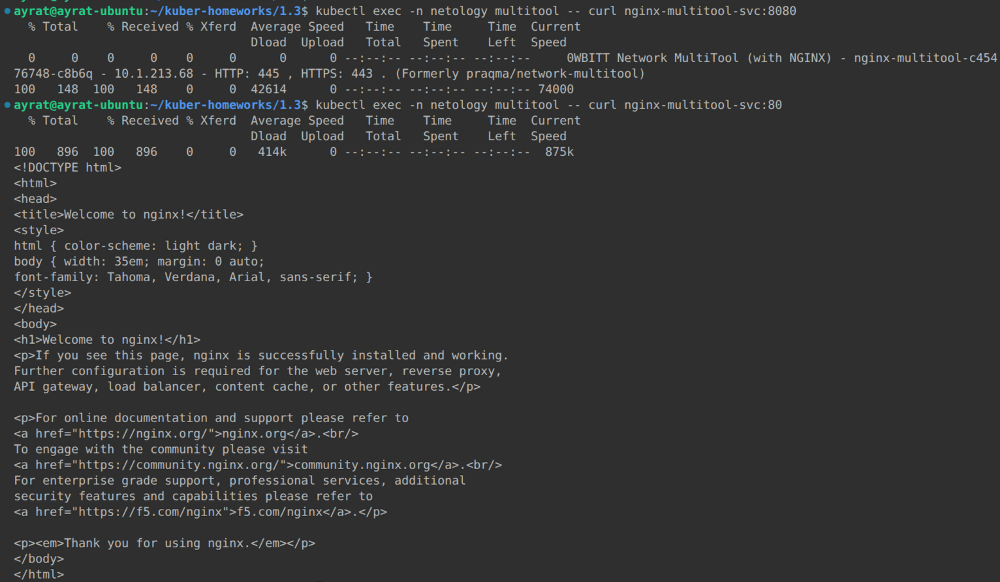  

Приложения отвечают.  


------

### Задание 2. Создать Deployment и обеспечить старт основного контейнера при выполнении условий

1. Создать Deployment приложения nginx и обеспечить старт контейнера только после того, как будет запущен сервис этого приложения.
2. Убедиться, что nginx не стартует. В качестве Init-контейнера взять busybox.
3. Создать и запустить Service. Убедиться, что Init запустился.
4. Продемонстрировать состояние пода до и после запуска сервиса.


**Выполнение:**  
Создал Deployment приложения nginx-deploy c условием старта контейнера только после того, как будет запущен сервис этого приложения. В качестве Init-контейнера взял busybox.  
[Ссылка на манифест nginx-deploy](https://github.com/AyratTukay/kuber-homeworks/blob/main/1.3/nginx-deploy.yaml)  
Применил манифест и проверил его запуск:  

  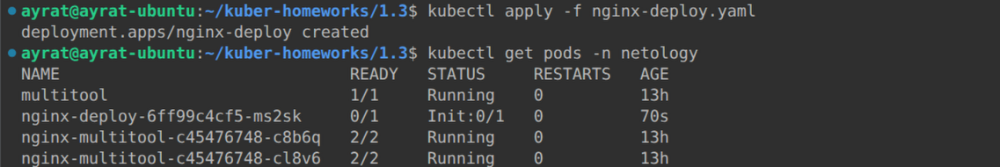  

Вижу что nginx-deploy-6ff99c4cf5-ms2sk не запущен, находится на стадий Init:0/1. Требуется создание сервиса для его запуска. Создал и пытаюсь запускаю сервис nginx-svc.  
[Ссылка на сервис nginx-svc](https://github.com/AyratTukay/kuber-homeworks/blob/main/1.3/nginx-svc.yaml)  

  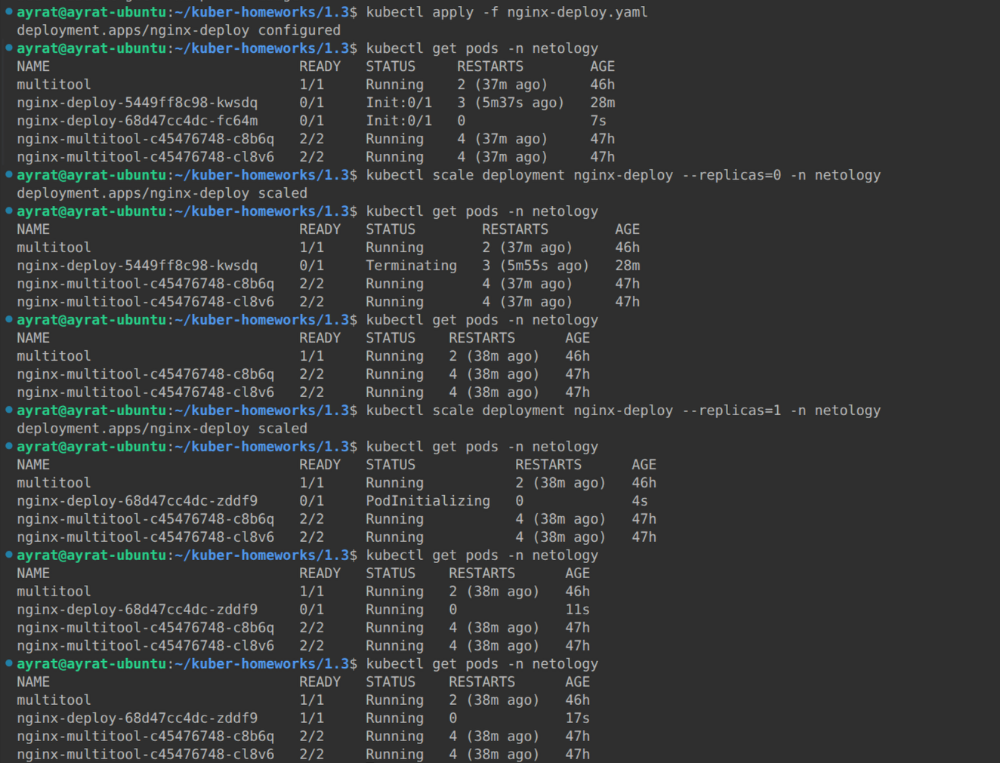  

Приложение не запускается. Образ busybox загружается и почему то падает. Целый день изучал в чём может быть дело. Пока не удаётся запустить. Прошу подсказать что смотреть. 
Вывод команды ```kubectl describe pod nginx-deploy-5449ff8c98-mjssv -n netology```.  
```
Name:             nginx-deploy-5449ff8c98-mjssv
Namespace:        netology
Priority:         0
Service Account:  default
Node:             ayrat-ubuntu/192.168.0.107
Start Time:       Sat, 19 Sep 2026 22:55:39 +0300
Labels:           app=nginx-svc
                  pod-template-hash=5449ff8c98
Annotations:      cni.projectcalico.org/containerID: e517d7b9290eec70216b433700de8d45da644409cca5e2f7df3728fbcf220336
                  cni.projectcalico.org/podIP: 10.1.213.94/32
                  cni.projectcalico.org/podIPs: 10.1.213.94/32
                  kubectl.kubernetes.io/restartedAt: 2026-09-19T22:54:03+03:00
Status:           Pending
IP:               10.1.213.94
IPs:
  IP:           10.1.213.94
Controlled By:  ReplicaSet/nginx-deploy-5449ff8c98
Init Containers:
  wait-for-service:
    Container ID:  containerd://8af9f02a7a78c34ed0c8de30f3a98bb28e5636bec77ea7eda8acd62fcd6c45a8
    Image:         busybox
    Image ID:      docker.io/library/busybox@sha256:dc2d74b28e4cf8984fa52af1f39bc7c3d9c73760b41a74d629f5d11b1ab28616
    Port:          <none>
    Host Port:     <none>
    Command:
      sh
      -c
      for i in $(seq 1 150); do
        if wget --spider --timeout=2 http://nginx-svc; then
          echo "Service is up."
          exit 0
        else
          CODE=$?
          echo "Attempt $i failed with code $CODE"
        fi
        sleep 2
      done
      exit 1
      
    State:          Running
      Started:      Sat, 19 Sep 2026 23:07:38 +0300
    Ready:          False
    Restart Count:  2
    Environment:    <none>
    Mounts:
      /var/run/secrets/kubernetes.io/serviceaccount from kube-api-access-lmcqm (ro)
Containers:
  nginx:
    Container ID:   
    Image:          nginx
    Image ID:       
    Port:           80/TCP
    Host Port:      0/TCP
    State:          Waiting
      Reason:       PodInitializing
    Ready:          False
    Restart Count:  0
    Readiness:      http-get http://:80/ delay=5s timeout=1s period=5s #success=1 #failure=3
    Environment:    <none>
    Mounts:
      /var/run/secrets/kubernetes.io/serviceaccount from kube-api-access-lmcqm (ro)
Conditions:
  Type                        Status
  PodReadyToStartContainers   True 
  Initialized                 False 
  Ready                       False 
  ContainersReady             False 
  PodScheduled                True 
Volumes:
  kube-api-access-lmcqm:
    Type:                    Projected (a volume that contains injected data from multiple sources)
    TokenExpirationSeconds:  3607
    ConfigMapName:           kube-root-ca.crt
    ConfigMapOptional:       <nil>
    DownwardAPI:             true
QoS Class:                   BestEffort
Node-Selectors:              <none>
Tolerations:                 node.kubernetes.io/not-ready:NoExecute op=Exists for 300s
                             node.kubernetes.io/unreachable:NoExecute op=Exists for 300s
Events:
  Type    Reason          Age    From     Message
  ----    ------          ----   ----     -------
  Normal  SandboxChanged  5m12s  kubelet  Pod sandbox changed, it will be killed and re-created.
  Normal  Pulling         4m58s  kubelet  Pulling image "busybox"
  Normal  Pulled          4m56s  kubelet  Successfully pulled image "busybox" in 2.574s (2.574s including waiting). Image size: 2236931 bytes.
  Normal  Created         4m55s  kubelet  Container created
  Normal  Started         4m55s  kubelet  Container started
```

Вывод команды ```kubectl logs nginx-deploy-5449ff8c98-kwsdq -c wait-for-service -n netology```.  

  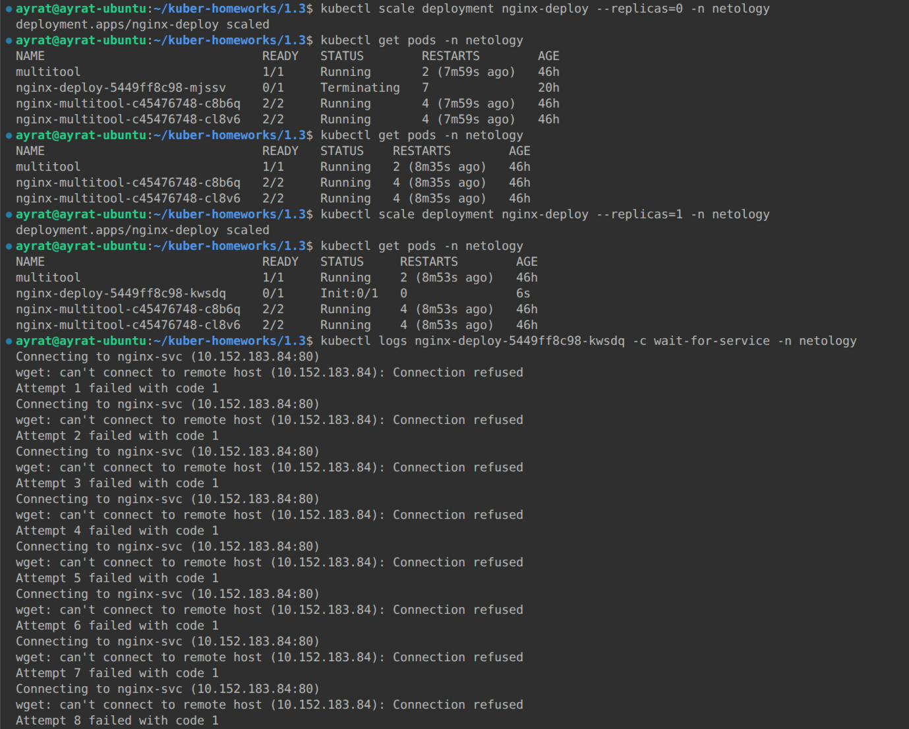  


------

### Правила приема работы

1. Домашняя работа оформляется в своем Git-репозитории в файле README.md. Выполненное домашнее задание пришлите ссылкой на .md-файл в вашем репозитории.
2. Файл README.md должен содержать скриншоты вывода необходимых команд `kubectl` и скриншоты результатов.
3. Репозиторий должен содержать файлы манифестов и ссылки на них в файле README.md.

------
